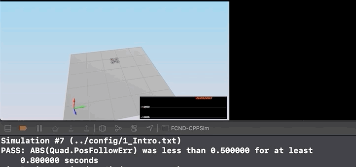
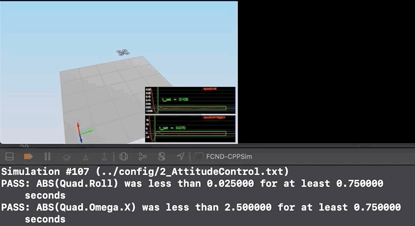

# The C++ Project Readme #

This is the Readme/Write-up for the C++ project.

## The Tasks ##

Implementing a cascade controller for quadrotors in C++ to control body rate/pitch/yaw, altitude, and lateral position


#### Notes on Parameter Tuning
1. **Comparison to Python**: Note that the vehicle you'll be controlling in this portion of the project has different parameters than the vehicle that's controlled by the Python code linked to above. **The tuning parameters that work for the Python controller will not work for this controller**

2. **Parameter Ranges**: You can find the vehicle's control parameters in a file called `QuadControlParams.txt`. The default values for these parameters are all too small by a factor of somewhere between about 2X and 4X. So if a parameter has a starting value of 12, it will likely have a value somewhere between 24 and 48 once it's properly tuned.

3. **Parameter Ratios**: In this [one-page document](https://www.overleaf.com/read/bgrkghpggnyc#/61023787/) you can find a derivation of the ratio of velocity proportional gain to position proportional gain for a critically damped double integrator system. The ratio of `kpV / kpP` should be 4.


## Submission Steps ##

Setup the Udacity C++ simulator repository and test the simulator

Adjust mass parameter in QuadControlParams.txt to make quadrotor stay at the same altitude.

Implemented body rate control and kpPQR in QuadControlParams.txt: To prevent vehicle from spinning.

Implement Roll/Pitch Control and tune kpBank in QuadControlParams.txt: to minimize the time it takes the quadrotor to settle without overshoot

Implement Lateral Position Control and Altitude Control and tune kpPosZ, kpPosZ, kpVelXY, kpVelZ: To make the vehicle reach their destination (approximately) with some errors.

Implement Yaw Control and tune kpYaw and the 3rd component of kpPQR: To minimize settling time.

Tweak the controller parameters to achieve robustness against some of the non-idealities of a controller.

Return the controller parameters to get vehicle to track a trajectory.

### Performance Metrics ###

The specific performance metrics are as follows:

 - scenario 2
   - roll should less than 0.025 radian of nominal for 0.75 seconds (3/4 of the duration of the loop)
   - roll rate should less than 2.5 radian/sec for 0.75 seconds

 - scenario 3
   - X position of both drones should be within 0.1 meters of the target for at least 1.25 seconds
   - Quad2 yaw should be within 0.1 of the target for at least 1 second


 - scenario 4
   - position error for all 3 quads should be less than 0.1 meters for at least 1.5 seconds

 - scenario 5
   - position error of the quad should be less than 0.25 meters for at least 3 seconds


## File Description ##
QuadControlParams.txt: File contains the configuration for the controller, the simulator checks the configs file during run-time and 
applies new parameters on the next loop execution upon changes.

QuadControl.cpp: File contains the implementation of the controller. The original file with placeholders for the controllers was provided by Udacity here. 


## Scenarios ##


#### Scenario 1: Intro ####
In the following scenario, our goal is to adjust the mass Parameter in QuadControlParams.txt to make the vehicle stay in the same altitude.




#### Scenario 2: Body Rate and Roll/Pitch Control ####
In the following scenario, the quadrotor is initialized with a small initial rotation speed about its roll axis.
The goal is to implement a body rate and roll/pitch controller to stabilize the rotational motion. 



Passing Criteria:

   - roll should less than 0.025 radian of nominal for 0.75 seconds (3/4 of the duration of the loop)
   - roll rate should less than 2.5 radian/sec for 0.75 seconds  

#### Scenario 3: Position/Velocity and Yaw Angle Control ####
In this scenario, there are 2 identical drones, one drone has been offset from
its target and initialized with zero yaw and the second one has been offset from
target point with 45 deg yaw. The goal of this scenario is to stabalize both the drones 
and make them reach their target position while maintaining their attitude.


Passing Criteria: 
   - X position of both drones should be within 0.1 meters of the target for at least 1.25 seconds
   - Quad2 yaw should be within 0.1 of the target for at least 1 second

#### Scenario 4: Non-Idealities and Robustness ####
In the following scenario, there are 3 quadrotors with some non-idealities:

Green: Green quadrotor mass has been shifted back
Orange: Orange quadrotor is an ideal quadrotor
Red: Red Quadrotor mass has been increased

The purpose of this scenario is to relax the controller, to improve its robustness of the control system,
so that all quads can reach their respective destination.


Passing Criteria:
   - position error for all 3 quads should be less than 0.1 meters for at least 1.5 seconds

#### Scenario 5: Tracking trajectories ####
The scenario tests the controller performance in tracking a trajectory.

Scenario has 2 quadrotors:
Orange: Follows: traj/FigureEight.txt
(Other)Yellow: Follows traj/FigureEightFF.txt


Passing Criteria: 
   - position error of the quad should be less than 0.25 meters for at least 3 seconds

## Rubix Points ##

## Write up ##

Provide a Writeup / README that includes all the rubric points and how you addressed each one. You can submit your write-up as markdown or pdf.

In the following sections, you will be able to see how I implemented each rubic point and where each point is handled in my code

## Implemented Controller ##

#### Implement Body Rate Control in C++ ####
Following part is implemented in QuadControl::BodyRateControl:

```
V3F rateErr = pqrCmd - pqr;
momentCmd = V3F(Ixx,Iyy,Izz) * kpPQR * rateErr;
```
    
#### Implement Roll Pitch Control in C++ ####
Following part is implemented in QuadControl::RollPitchControl:

```
float targetBX = 0.0;
float targetBY = 0.0;
if (collThrustCmd > 0.0)
{
  float c = collThrustCmd/mass;
  targetBX = -CONSTRAIN(accelCmd.x/c, -maxTiltAngle, maxTiltAngle);
  targetBY = -CONSTRAIN(accelCmd.y/c, -maxTiltAngle, maxTiltAngle);
}
float bX = targetBX - R(0, 2);
float bY = targetBY - R(1, 2);

pqrCmd.x = kpBank *((R(1, 0) * bX) - (R(0, 0) * bY)) / R(2, 2);
pqrCmd.y = kpBank *((R(1, 1) * bX) - (R(0, 1) * bY)) / R(2, 2);
pqrCmd.z = 0.f;
```

#### Implement Altitude Controller in C++ ####
Following part is implemented in QuadControl::AltitudeControl:

```
float zErr = posZCmd - posZ;
integratedAltitudeError += zErr * dt;

float velZRef = velZCmd + (kpPosZ * zErr) + (KiPosZ * integratedAltitudeError);
velZRef = -CONSTRAIN(-velZRef, -maxDescentRate, maxAscentRate);
float accelCmd = accelZCmd + (kpVelZ*(velZRef - velZ));
thrust = mass * (9.81f - (accelCmd / R(2,2)));

```
#### Implement lateral position control in C++ ####
Following part is implemented in QuadControl::LateralPositionControl:

```
velCmd.constrain(-maxSpeedXY,maxSpeedXY);
V3F posErr = posCmd - pos;
V3F velErr = velCmd - vel;
accelCmd = accelCmdFF + (kpPosXY * posErr) + (kpVelXY * velErr); //z compent is zero, so let's ignore use kpPosXY/kpVelXY for pos.z/vel.z as well
accelCmd.constrain(-maxAccelXY,maxAccelXY);
accelCmd.z = 0;
```


#### Implement yaw control in C++ ####
Following part is implemented in QuadControl::YawControl:

```
yawCmd = fmod(yawCmd, (2.0f*F_PI));

if (yawCmd <= -F_PI)
{
 yawCmd += (2.0f*F_PI);
}
else if (yawCmd > F_PI)
{
 yawCmd -= (2.0f*F_PI);
}

yawRateCmd = kpYaw * (yawCmd - yaw);
```

#### Implement calculating the motor commands given commanded thrust and moments in C++ ####
Following part is implemented in QuadControl::GenerateMotorCommands:

```
float l = L / sqrtf(2.f);
float cBar = collThrustCmd / 4.f;
float pBar = momentCmd.x / (l * 4.f);
float qBar = momentCmd.y / (l * 4.f);
float rBar = momentCmd.z / (kappa * 4.f);

cmd.desiredThrustsN[0] = cBar + pBar + qBar + rBar; // front left
cmd.desiredThrustsN[1] = cBar - pBar + qBar - rBar; // front right
cmd.desiredThrustsN[2] = cBar + pBar - qBar - rBar; // rear left
cmd.desiredThrustsN[3] = cBar - pBar - qBar + rBar; // rear right

```
## Flight Evaluation ##

The result of each scenario is displayed in the gifs. Implementation of the above codes passes scenario 1-5.

```
#Scenario 1
PASS: ABS(Quad.PosFollowErr) was less than 0.500000 for at least 0.800000 seconds
#Scenario 2
PASS: ABS(Quad.Roll) was less than 0.025000 for at least 0.750000 seconds
PASS: ABS(Quad.Omega.X) was less than 2.500000 for at least 0.750000 seconds
#Scenario 3
PASS: ABS(Quad1.Pos.X) was less than 0.100000 for at least 1.250000 seconds
PASS: ABS(Quad2.Pos.X) was less than 0.100000 for at least 1.250000 seconds
PASS: ABS(Quad2.Yaw) was less than 0.100000 for at least 1.000000 seconds
#Scenario 4
PASS: ABS(Quad1.PosFollowErr) was less than 0.100000 for at least 1.500000 seconds
PASS: ABS(Quad2.PosFollowErr) was less than 0.100000 for at least 1.500000 seconds
PASS: ABS(Quad3.PosFollowErr) was less than 0.100000 for at least 1.500000 seconds

#Scenario 5
PASS: ABS(Quad2.PosFollowErr) was less than 0.250000 for at least 3.000000 seconds
```